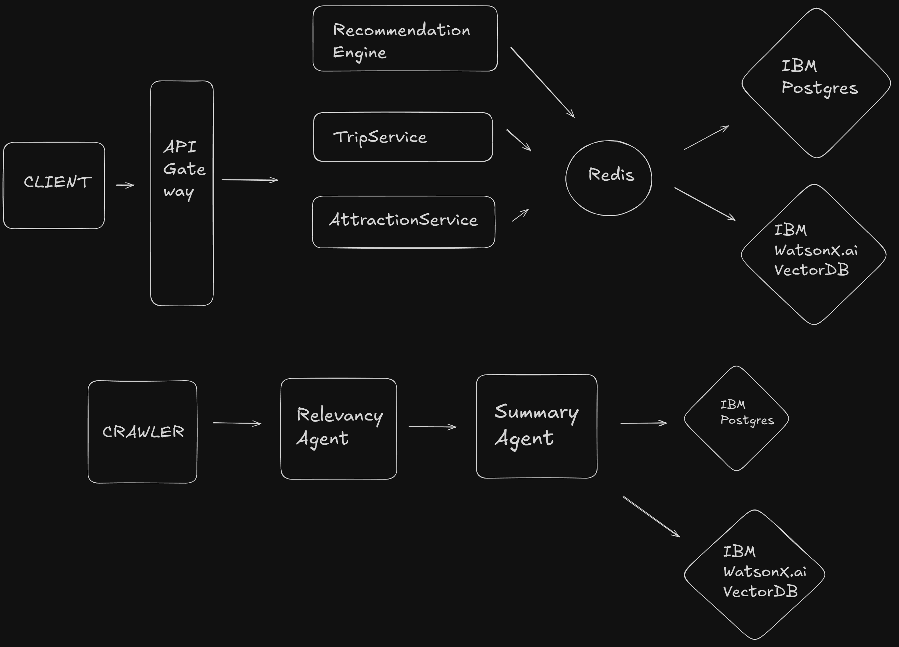
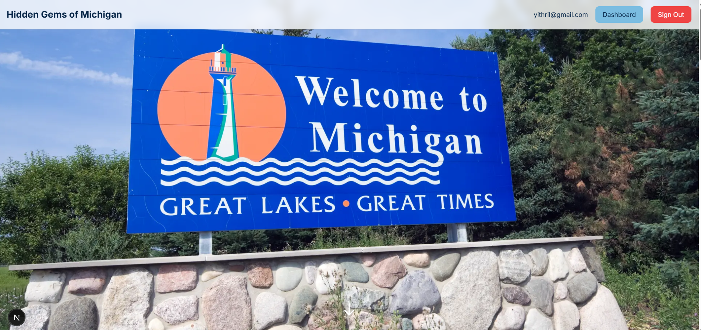

# Hidden Gems of Michigan

> Discovering the lesser-known treasures of the Great Lakes State and driving tourism dollars to local communities

## 🌟 About

**Hidden Gems** is an intelligent travel planning platform designed to help travelers discover the authentic, off-the-beaten-path experiences that Michigan has to offer. Our mission is to connect visitors with unique local attractions, driving tourism dollars to smaller communities and supporting local economies across the state.

While many travelers know about Michigan's popular destinations like Mackinac Island or Traverse City, countless hidden gems remain undiscovered. These lesser-known destinations offer authentic experiences, from quiet beaches and maritime museums to wildlife sanctuaries and geological wonders. Our platform makes it easy to find and plan trips to these special places.

### Key Features

- 🗺️ **Intelligent Trip Planning**: AI-powered conversation system that understands your travel preferences and creates personalized itineraries
- 📍 **Hidden Gem Discovery**: Curated database of unique attractions across Michigan's lesser-known destinations
- 📸 **Visual Inspiration**: Beautiful imagery showcasing the beauty of Michigan's hidden treasures
- 📅 **Day-by-Day Itineraries**: Build detailed day plans with activities organized by time slots
- 💰 **Local Economy Focus**: Designed to drive tourism to smaller communities and support local businesses

## 🎯 The Problem We're Solving

Michigan's tourism industry is often concentrated in well-known destinations, leaving many smaller communities and unique attractions undiscovered. This concentration means:

- Local businesses in smaller communities miss out on tourism revenue
- Travelers miss authentic, uncrowded experiences
- Hidden natural and cultural treasures remain underappreciated

**Hidden Gems** addresses this by making it easy to discover and plan trips to these lesser-known destinations, spreading tourism dollars more equitably across the state.

## 🖼️ System Design

Our platform is built with a modern, scalable architecture that combines conversational AI with intelligent recommendation systems:

### Architecture Overview

- **Conversational Trip Planning**: Interactive AI agent that understands natural language to help users define their ideal trip
- **Smart Recommendations**: Algorithm that matches travelers with attractions based on their preferences (vibes, budget, companions)
- **Flexible Itinerary Builder**: Intuitive day-by-day planning tool that lets users customize every aspect of their trip
- **Rich Media**: High-quality imagery and detailed information for each destination

## 🎨 The Platform

Experience the beauty of Michigan's hidden gems:

Our platform provides an intuitive, visually-rich experience that makes trip planning both informative and inspiring. From the initial discovery phase through detailed itinerary planning, every interaction is designed to help users find their perfect Michigan adventure.

## 💡 How It Works

1. **Tell Us Your Preferences**: Start a conversation with our AI assistant about what you're looking for in your Michigan trip
2. **Get Personalized Recommendations**: Our system matches you with attractions and destinations that fit your style
3. **Build Your Itinerary**: Use our day-by-day planner to organize activities, from morning to evening
4. **Discover Hidden Gems**: Explore curated collections of lesser-known destinations with detailed information and imagery

## 🏗️ Technology Stack

### Backend
- **FastAPI**: High-performance Python web framework
- **Tortoise ORM**: Modern async ORM for database operations
- **AI Agent System**: Custom conversational AI for trip planning
- **PostgreSQL**: Robust relational database

### Frontend
- **Next.js 16**: React framework with server-side rendering
- **TypeScript**: Type-safe development
- **Tailwind CSS**: Modern, utility-first styling
- **NextAuth**: Secure authentication system

## 🌲 Featured Destinations

Our platform includes detailed information about hidden gems like:

- **Alpena**: Maritime heritage, shipwreck tours, and quiet beaches
- **Rockport State Recreation Area**: Fossil beds and undeveloped Lake Huron shoreline
- **Island Park & Wildlife Sanctuary**: Peaceful nature trails and wildlife viewing
- And many more lesser-known treasures across Michigan

## 🚀 Impact

By helping travelers discover Michigan's hidden gems, we aim to:

- **Support Local Communities**: Drive tourism revenue to smaller communities
- **Preserve Natural Spaces**: Encourage appreciation and responsible tourism
- **Enhance Travel Experiences**: Help visitors discover authentic, uncrowded destinations
- **Promote Economic Development**: Spread tourism dollars more equitably across the state

## 📝 License

This project is developed for educational and demonstration purposes.

---

*Built with ❤️ to showcase the hidden treasures of Michigan*
